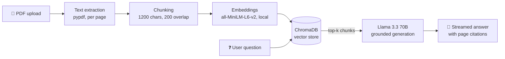

# 📄 DocuChat — Chat with your PDF (RAG)

A Retrieval-Augmented Generation app: upload any PDF and ask questions about it. Answers are grounded strictly in the document and every claim carries a **page citation** (`[p. 12]`), so hallucination is both discouraged and easy to spot. Runs on a **100% free stack** — local embeddings + Llama 3.3 70B via Groq's free tier.

## Architecture



## How it works

1. **Ingest** — `pypdf` extracts text page by page; pages are split into ~1200-character chunks with 200-character overlap so answers spanning a boundary aren't lost.
2. **Embed & store** — chunks are embedded with all-MiniLM-L6-v2 (local and free — ChromaDB's default ONNX embedding function) and stored in an in-memory ChromaDB collection with cosine similarity.
3. **Retrieve** — each question is embedded and the top-k most similar chunks are fetched, each tagged with its source page.
4. **Generate** — the LLM answers from the retrieved excerpts only, citing pages inline; if the document doesn't contain the answer, it says so instead of guessing. Responses stream token-by-token, and chat history is passed back so follow-up questions work.

## Quickstart

```bash
git clone <this-repo>
cd pdf-rag-chat
python -m venv .venv && source .venv/bin/activate
pip install -r requirements.txt

cp .env.example .env   # add your free GROQ_API_KEY from console.groq.com

streamlit run app.py
```

## Deployment

**Streamlit Community Cloud** (free): push to GitHub → share.streamlit.io → New app → set `GROQ_API_KEY` in app secrets.

**Hugging Face Spaces**: create a Streamlit Space, push this repo, add `GROQ_API_KEY` as a Space secret.

## Configuration

| Env var | Default | Purpose |
|---|---|---|
| `GROQ_API_KEY` | — | Required — free at console.groq.com |
| `GROQ_MODEL` | `llama-3.3-70b-versatile` | Generation model |

## Project layout

```
rag/
  ingest.py   # extraction, chunking, embedding, retrieval
  chat.py     # grounded, streamed generation with citations
app.py        # Streamlit chat UI
```

## Design choices worth discussing in an interview

- **Chunk overlap** prevents boundary-loss of answers; chunk size trades retrieval precision against context richness.
- **Page-level citations** make groundedness verifiable by the user — a practical hallucination control.
- **Local embeddings** keep per-query cost to a single (free) LLM call; swapping in a hosted embedding model is a one-line change.
- **Ephemeral vector store** fits the "one document per session" UX; a persistent Chroma client would support a multi-document library.
